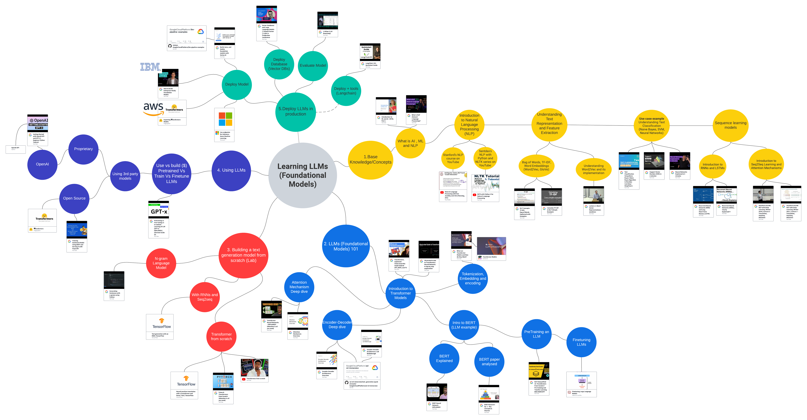

# 🐳 Awesome-Multimodal-LLM 
🔥 Keep up with the advancements in multimodal large language models

---

## Table of Contents

- [🐳 Awesome-Multimodal-LLM](#-awesome-multimodal-llm)
  - [Table of Contents](#table-of-contents)
  - [Surveys](#surveys)
  - [Github](#github)
  - [Workshops](#workshops)
  - [Books](#books)
  - [Others](#others)

---

## Surveys
|  Title  |   Institution  |   Date   |   Notes   |
|:--------|:--------:|:--------:|:--------:|
| **[A Comprehensive Review of Multimodal Large Language Models: Performance and Challenges Across Different Tasks](https://arxiv.org/pdf/2408.01319)** | University of Georgia | 2024.08 | 
| **[The Revolution of Multimodal Large Language Models: A Survey](https://arxiv.org/pdf/2402.12451)** | University of Modena and Reggio Emilia, Italy | 2024.06 | 
| **[The Evolution of Multimodal Model Architectures](https://arxiv.org/pdf/2405.17927)** | Purdue University, Amazon | 2024.05 | 
| **[MM-LLMs: Recent Advances in MultiModal Large Language Models](https://arxiv.org/pdf/2401.13601)** | Tencent AI Lab | 2024.05 | 
| **[Efficient Multimodal Large Language Models: A Survey](https://arxiv.org/pdf/2405.10739v1)** | Youtu Lab, Tencent | 2024.05 | 
| **[A Survey of Multimodal Large Language Model from A Data-centric Perspective](https://arxiv.org/pdf/2405.16640)** | Hong Kong University of Science and Technology | 2024.05 | 
| **[A Survey on Multimodal Large Language Models](https://arxiv.org/pdf/2306.13549)** | Youtu Lab, Tencent | 2024.01 | 

## Github

|  Title  |   Github  |   Date   |   Notes   |
|:--------|:--------:|:--------:|:--------:|
| **[Awesome_Multimodel_LLM](https://github.com/Atomic-man007/Awesome_Multimodel_LLM)** |  |  | 

## Workshops

## Books

## Others